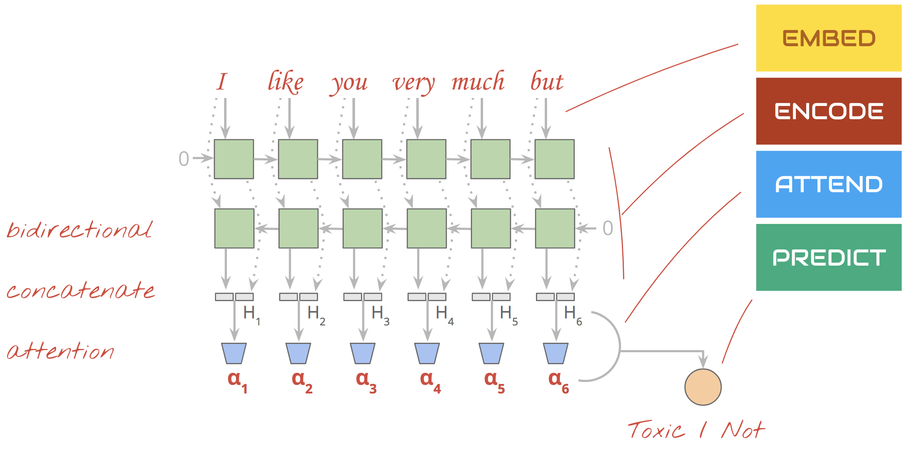

# Attention Based Classification Tutorial

**Recommended time: 30 minutes**

**Contributors: nthain, martin-gorner**


This tutorial provides an introduction to building text classification models in tensorflow that use attention to provide insight into how classification decisions are being made. We will build our tensorflow graph following the Embed - Encode - Attend - Predict paradigm introduced by Matthew Honnibal. For more information about this approach, you can refer to:

Slides: https://goo.gl/BYT7au

Video: https://youtu.be/pzOzmxCR37I

Figure 1 below provides a representation of the full tensorflow graph we will build in this tutorial.



This tutorial was created in collaboration with the Tensorflow without a PhD series. To check out more episodes, tutorials, and codelabs from this series, please visit: 

https://github.com/GoogleCloudPlatform/tensorflow-without-a-phd


## To Run Locally

1.  Setup a (virtualenv)[https://virtualenvwrapper.readthedocs.io/en/latest/] for
    the project (recommended, but technically optional).
    ```

    Python 3:

    ```
    python3 -m venv env
    ```

    From either to enter your virtual env:

    ```shell
    source env/bin/activate
    ```

2.  Install library dependencies:

    ```shell
    pip install -r requirements.txt
    ```
    
